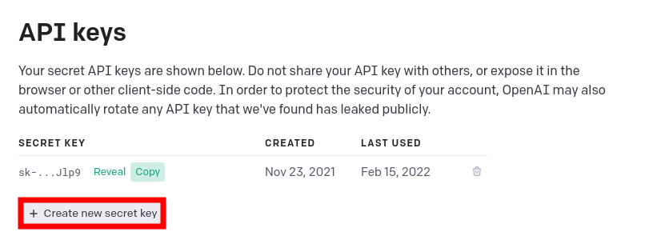

*Ce workshop à pour but de vous faire découvrir OpenAi et son API publique, en créant un CLI pour résumer du texte.*

# Déroulement du workshop
- [Introduction](#Introduction)
- [Introduction à l'api](#API)
- [Création d'un cli](#Cli)

# Introduction
## OpenAI


OpenAI est une entreprise en intelligence artificielle, basée à San Francisco. Son but est de promouvoir et développer une intelligence artificielle à visage humain qui bénéficiera à toute l'humanité. *(Wikipedia)*

## GPT-3

GPT-3 est une intelligence artificielle de génération de langage créée par OpenAI. Il s’agit à ce jour du réseau de neurones artificiels le plus complexe du monde, et de l’IA linguistique et textuelle la plus avancée. 

Ce modèle a 175 milliards de paramètres, à savoir les valeurs qu’un réseau de neurones essaye d’optimiser pendant l’entraînement. En comparaison, son prédécesseur GPT-2 en avait déjà 1,5 milliard.

*(GTP-4 cible les 100 Billards de paramètres, 500x plus que GPT-3)*

## L'API openAI

Lors du lancement de GPT-2, OpenIA craignait que son outil soit trop dangereux pour être relâché dans la nature. La firme basée à San Francisco craignait qu’il soit utilisé pour produire des  "Fake News" en masse. Elle avait donc choisi dans un premier temps de ne proposer qu’une version limitée au téléchargement.

Faisant preuve de la même prudence pour GPT-3, OpenAI a préféré proposer cette nouvelle version sous forme d’endpoint API basée sur le Cloud. L’outil est donc délivré sous la forme d’un service Cloud pour éviter son usage par des acteurs mal intentionnés et à des fins lucratives. Ainsi, l’entreprise garde un contrôle sur sa créature.

# API

Tout d’abord, nous allons voir comment l’API fonctionne.
Pour faire des requêtes, il faut utiliser une clé d’API. Pour obtenir une clé d’API, inscrivez vous sur [OpenAI](https://beta.openai.com/signup).
Vous pourrez ensuite créer une clé d’API dans votre [compte](https://beta.openai.com/account/api-keys).



Une fois la clé d’API créée, vous pouvez utiliser l’API en utilisant l’URL suivante : ``https://api.openai.com/v1/`` suivi de l'engine que vous souhaitez utiliser (text-davinci-001 dans notre cas) et de l'action que vous souhaitez effectuer (completions). 

Un exemple de requêtre Curl :
```sh
curl https://api.openai.com/v1/engines/text-davinci-001/completions \
  -H "Content-Type: application/json" \
  -H "Authorization: Bearer $OPENAI_API_KEY" \
  -d '{
  "prompt": "Translate this into 1. French, 2. Spanish and 3. Japanese:\n\nWhat rooms do you have available?\n\n1.",
  "temperature": 0.3,
  "max_tokens": 100,
  "top_p": 1,
  "frequency_penalty": 0,
  "presence_penalty": 0
}'
```

# Cli
Maintenant que nous avons vu l'API, nous allons voir comment créer un cli pour l'utiliser. Vous pouvez utiliser le languge de programmation de votre choix pour cette étape. *Je recommande Python/Javascript.*

Le but de ce CLI de résumer du texte en utilisant l'engine ``text-davinci-001``

Si vous êtes perdus, vous pouvez toujours visiter la page [quickstart tutorial](https://beta.openai.com/docs/quickstart/build-your-application) pour avoir un exemple d'application NodeJS/Python qui utilise l'API.

*Note: GPT-3 comprends le language HUMAIN, n'oubliez donc pas d'inclure ce qu'il doit faire du texte que vous lui passez.*  
Ex: Explique moi le concept de : ``${input}``

# Codex : L'engine de génération de code à l'aide du language humain.

Utilisé par Microsoft dans GitHub CoPilot, il permet de générer du code de contexte, de language humain ou simplement de résoudre des problèmes simples.  
Ce modèle est pour l'instant en beta privée.  

Ci-dessous une vidéo de la présentation de la puissance de ce modèle.  

[](https://player.vimeo.com/video/583550498?loop=1 "Video") 

